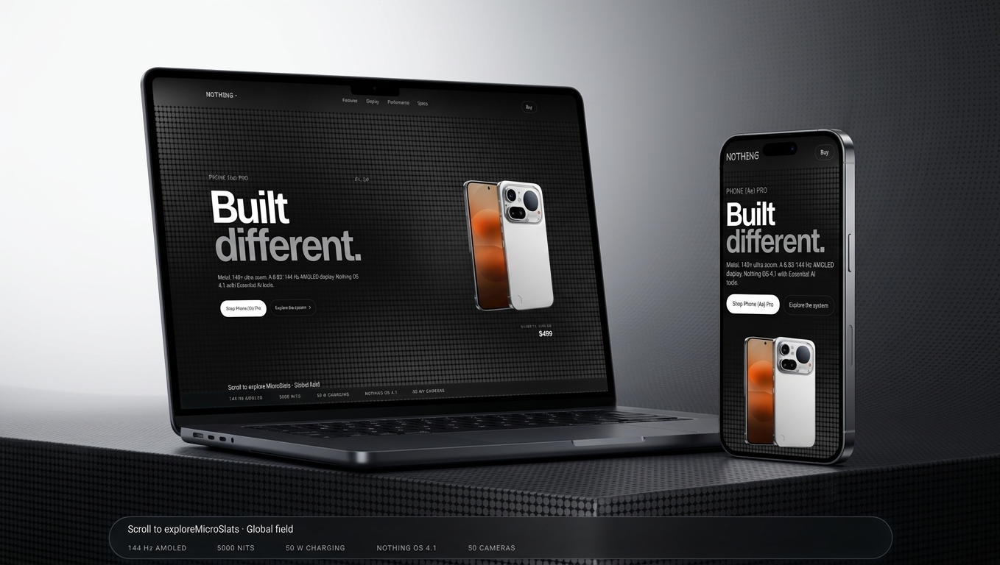

# Nothing — Product Experience

An immersive product website inspired by Nothing's industrial design language. Built as a polished frontend concept focusing on product presentation, typography, responsive layouts, motion, and WebGL-based visual effects.

## Live Demo
 [b-1-o.github.io/nothing](https://b-1-o.github.io/nothing/)





## Features
- Product-focused visual system
- Responsive layouts
- Custom interactive components
- Motion and transition effects
- WebGL / OGL visual layer
- Modern Next.js architecture
- Dark, minimal interface

## Tech Stack
Next.js 16 · React 19 · TypeScript · OGL · CSS

## How it works
- The visual layer is built on OGL for lightweight WebGL rendering.
- Typography and layout mirror Nothing's dot-matrix and experimental aesthetic.
- Animations are driven by CSS and requestAnimationFrame for smooth transitions.
- Static export configured for GitHub Pages deployment.

## Getting Started
```bash
git clone https://github.com/b-1-o/nothing.git
cd nothing
npm install
npm run dev
```
